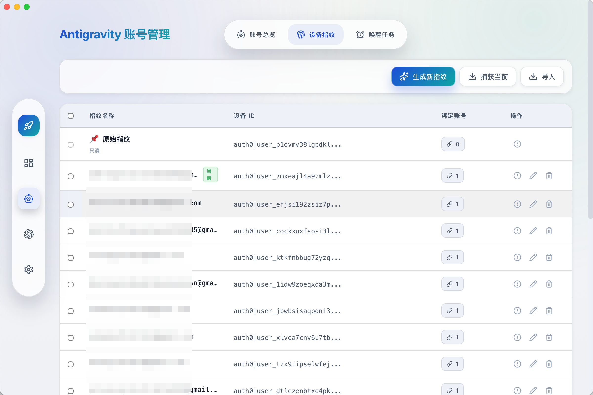

# Cockpit Tools Local

[English](README.en.md) · [Portuguese (BR)](README.pt-br.md) · 简体中文

[](https://github.com/sciman-top/cockpit-tools-local/releases)

## 先看这里：这是 Cockpit Tools Local 自用版

本仓库是 [`jlcodes99/cockpit-tools`](https://github.com/jlcodes99/cockpit-tools) 的个人自用版 fork，不是官方原版发布仓库。GitHub 首页、Release、版本号和安装资产都按 `Cockpit Tools Local` 自用版语义维护。

| 领域 | Cockpit Tools Local 自用版 | 官方原版 |
| --- | --- | --- |
| 仓库与产品身份 | `sciman-top/cockpit-tools-local`、产品名 `Cockpit Tools Local`、Tauri identifier `com.sciman.cockpit-tools-local` | `jlcodes99/cockpit-tools` 官方项目身份 |
| 版本与发布 | 使用 `0.24.10-local.1` 这类本地后缀；Release 只发布自用版构建产物，不镜像官方安装资产 | 使用官方版本号与官方发布资产 |
| 上游吸收方式 | `main` 保持自用主线，官方源码只作为 `upstream/main` 输入；通过本地隔离分支/worktree 深度审查后合并 | 官方项目自身开发主线 |
| Codex 本地增强 | 保留本地 API Service、hardened gateway、账号池/跟随当前账号、provider 投影、session 可见性、quota/cooldown 和连续性守卫 | 以官方默认实现为准 |
| 安全与运行边界 | live upstream probe、drain、dev app/server、release exe 替换等需要显式确认；不自动打断当前 Codex/Cockpit 运行 | 不适用本机自用运行守卫 |
| 合并裁决 | 冲突/重叠默认保留自用版；官方实现明显更优时先说明推荐理由并等待确认 | 不维护本地自用差异 |

主要自有特性/功能包括：Codex Direct OAuth 与 API Key provider 往返切换、本地 API Service 小池调度、hardened local API mode、quota/cooldown registry、stream/audit 脱敏证据链、账号缓存清洗、Windows-first 本机入口、self-use release 流程，以及保留官方 CLIProxyAPI sidecar 的兼容吸收能力。

完整差异与合并守卫见 [自用差异清单](docs/SELF_USE_DELTA.md)，后续吸收官方新版按 [官方上游吸收策略](docs/UPSTREAM_SYNC_POLICY.md) 执行。

Hardened API 相关产品合同、总控入口与执行文档见：

- [目标架构蓝图](docs/COCKPIT_LOCAL_TARGET_ARCHITECTURE.md)
- [产品需求书](docs/HARDENED_API_PRODUCT_REQUIREMENTS.md)
- [总控计划](docs/HARDENED_API_MASTER_PLAN.md)
- [下一阶段 Backlog](docs/LOCAL_HARDENED_API_NEXT_PHASE_BACKLOG.md)
- [Codex 协议附录](docs/LOCAL_HARDENED_API_CODEX_RESPONSES_PROTOCOL.md)
- [用户旅程验收矩阵](docs/LOCAL_HARDENED_API_ACCEPTANCE_MATRIX.md)
- [总体路线图](docs/LOCAL_HARDENED_API_ROADMAP.md)

一款**通用的 AI IDE 账号管理工具**，目前支持 **Antigravity IDE**、**Codex**、**GitHub Copilot**、**Windsurf**、**Kiro**、**Cursor**、**Gemini Cli**、**CodeBuddy**、**CodeBuddy CN**、**Qoder**、**Trae** 和 **Zed**，并支持多账号多实例并行运行。


> 本工具旨在帮助用户高效管理多个 AI IDE 账号，支持一键切换、配额监控、自动唤醒与多开实例并行运行，助您充分利用不同账号的资源。

**功能**：一键切号 · 多账号管理 · 多开实例 · 配额监控 · 唤醒任务 · 设备指纹 · 插件联动 · GitHub Copilot 管理 · Windsurf 管理 · Kiro 管理 · Cursor 管理 · Gemini Cli 管理 · CodeBuddy 管理 · CodeBuddy CN 管理 · Qoder 管理 · Trae 管理 · Zed 管理

**语言**：支持 18 种语言

🇺🇸 English · 🇨🇳 简体中文 · 繁體中文 · 🇯🇵 日本語 · 🇩🇪 Deutsch · 🇪🇸 Español · 🇫🇷 Français · 🇮🇹 Italiano · 🇰🇷 한국어 · 🇧🇷 Português · 🇷🇺 Русский · 🇹🇷 Türkçe · 🇵🇱 Polski · 🇨🇿 Čeština · 🇸🇦 العربية · 🇻🇳 Tiếng Việt · 🇮🇩 Bahasa Indonesia

**官方支持平台**：macOS、Windows、Linux。

---

## 功能概览

### 1. 仪表盘 (Dashboard)

全新的可视化仪表盘，为您提供一站式的状态概览：

- **十二平台支持**：同时展示 Antigravity IDE、Codex、GitHub Copilot、Windsurf、Kiro、Cursor、Gemini Cli、CodeBuddy、CodeBuddy CN、Qoder、Trae 与 Zed 的账号状态
- **配额监控**：实时查看各模型剩余配额、重置时间
- **快捷操作**：一键刷新、一键唤醒
- **可视化进度**：直观的进度条展示配额消耗情况

> 

### 2. Antigravity IDE 账号管理

- **一键切号**：一键切换当前使用的账号，无需手动登录登出
- **多种导入**：支持 OAuth 授权、Refresh Token、插件同步
- **唤醒任务**：定时唤醒 AI 模型，提前触发配额重置周期
- **设备指纹**：生成、管理、绑定设备指纹，降低风控风险

> 
>
> *(唤醒任务与设备指纹管理)*
> 
> 

#### 2.1 Antigravity IDE 多开实例

支持同一平台多账号多实例并行运行。比如同时打开两个 Antigravity IDE，分别绑定不同账号，分别处理不同项目，互不影响。

- **独立账号**：每个实例绑定不同账号并独立运行
- **并行项目**：多实例同时处理不同任务/项目
- **参数隔离**：支持自定义实例目录与启动参数

> 

### 3. Codex 账号管理

- **专属支持**：专为 Codex 优化的账号管理体验
- **配额展示**：清晰展示 Hourly 和 Weekly 配额状态
- **计划识别**：自动识别账号 Plan 类型 (Basic, Plus, Team 等)
- **API 服务与切换归属**：Cockpit Tools Local 原生负责 Codex Direct OAuth、Direct API/API Key provider 与本地 API Service 的往返切换，包括单账号池/跟随当前账号、provider 写入、会话可见性修复、托管实例启动状态、账号同步、配置投影、状态与用量统计；本地版优先保留 hardened gateway 与连续性守卫，并兼容官方 CLIProxyAPI sidecar 的配置模型。

> 

#### 3.1 Codex 多开实例

Codex 同样支持多账号多实例并行运行。比如同时打开两个 Codex，分别绑定不同账号，分别处理不同项目，互不影响。

- **独立账号**：每个实例绑定不同账号并独立运行
- **并行项目**：多实例同时处理不同任务/项目
- **参数隔离**：支持自定义实例目录与启动参数

> 

### 4. GitHub Copilot 账号管理

- **账号导入**：支持 OAuth 授权、Token/JSON 导入
- **配额视图**：展示 Inline Suggestions / Chat messages 使用情况与重置时间
- **订阅识别**：自动识别 Free / Individual / Pro / Business / Enterprise 等计划类型
- **批量管理**：支持标签与批量操作

#### 4.1 GitHub Copilot 多开实例

基于 VS Code 的 Copilot 多实例管理，支持独立配置与生命周期控制。

- **独立配置**：每个实例拥有独立的用户目录
- **快速启停**：一键启动/停止/强制关闭实例
- **窗口管理**：支持打开实例窗口与批量关闭

### 5. Windsurf 账号管理

- **账号导入**：支持 OAuth 授权、Token/JSON 导入与本地导入
- **配额视图**：展示 Plan、User Prompt credits、Add-on prompt credits 与周期信息
- **批量管理**：支持标签与批量操作
- **切号注入**：支持切号后注入并启动 Windsurf

#### 5.1 Windsurf 多开实例

支持 Windsurf 多实例管理，支持独立配置与生命周期控制。

- **独立配置**：每个实例拥有独立的用户目录
- **快速启停**：一键启动/停止/强制关闭实例
- **窗口管理**：支持打开实例窗口与批量关闭

### 6. Kiro 账号管理

- **账号导入**：支持 OAuth 授权、Token/JSON 导入与本地导入
- **配额视图**：展示 Plan、User Prompt credits、Add-on prompt credits 与周期信息
- **批量管理**：支持标签与批量操作
- **切号注入**：支持切号后注入并启动 Kiro

#### 6.1 Kiro 多开实例

支持 Kiro 多实例管理，支持独立配置与生命周期控制。

- **独立配置**：每个实例拥有独立的用户目录
- **快速启停**：一键启动/停止/强制关闭实例
- **窗口管理**：支持打开实例窗口与批量关闭

### 7. Cursor 账号管理

- **账号导入**：支持 OAuth 授权、Token/JSON 导入与本地导入
- **配额视图**：展示 Total Usage、Auto + Composer、API Usage、On-Demand 与周期信息
- **批量管理**：支持标签与批量操作
- **切号注入**：支持切号后注入并启动 Cursor

#### 7.1 Cursor 多开实例

支持 Cursor 多实例管理，支持独立配置与生命周期控制。

- **独立配置**：每个实例拥有独立的用户目录
- **快速启停**：一键启动/停止/强制关闭实例
- **窗口管理**：支持打开实例窗口与批量关闭

### 8. Gemini Cli 账号管理

- **账号导入**：支持 OAuth 授权、Token/JSON 导入与本地导入
- **配额视图**：展示 Total Usage、Auto + Composer、API Usage、On-Demand 与周期信息
- **批量管理**：支持标签与批量操作
- **切号注入**：支持切号后注入 Gemini Cli 本地凭证（`~/.gemini`）
- **平台限制**：Gemini Cli 暂不支持多开实例管理

### 9. CodeBuddy 账号管理

- **账号导入**：支持 OAuth 授权、Token/JSON 导入
- **配额视图**：支持配额查询、周期信息与加量包展示
- **批量管理**：支持标签与批量操作
- **切号注入**：支持切号后注入并启动 CodeBuddy

#### 9.1 CodeBuddy 多开实例

支持 CodeBuddy 多实例管理，支持独立配置与生命周期控制。

- **独立配置**：每个实例拥有独立的用户目录
- **快速启停**：一键启动/停止/强制关闭实例
- **窗口管理**：支持打开实例窗口与批量关闭

### 10. CodeBuddy CN 账号管理

- **账号导入**：支持 OAuth 授权、Token/JSON 导入与本机客户端导入
- **配额视图**：展示套餐与用量状态，并支持跳转官方网页查看配额详情
- **批量管理**：支持标签与批量操作
- **切号注入**：支持切号后按客户端本地认证存储规则注入并启动 CodeBuddy CN

#### 10.1 CodeBuddy CN 多开实例

支持 CodeBuddy CN 多实例管理，支持独立配置与生命周期控制。

- **独立配置**：每个实例拥有独立的用户目录
- **快速启停**：一键启动/停止/强制关闭实例
- **窗口管理**：支持打开实例窗口与批量关闭

### 11. Qoder 账号管理

- **账号导入**：支持本机导入与 JSON 导入
- **配额视图**：展示 Credits 使用、剩余额度与套餐原始值
- **批量管理**：支持标签、筛选、导出与批量删除/刷新
- **切号注入**：支持切号后注入并启动 Qoder

#### 11.1 Qoder 多开实例

支持 Qoder 多实例管理，支持独立配置与生命周期控制。

- **独立配置**：每个实例拥有独立的用户目录
- **快速启停**：一键启动/停止/强制关闭实例
- **窗口管理**：支持打开实例窗口与批量关闭

### 12. Trae 账号管理

- **账号导入**：支持本机导入与 JSON 导入
- **配额视图**：展示套餐原始值、美元消耗/总额度与重置时间
- **批量管理**：支持标签、筛选、导出与批量删除/刷新
- **切号注入**：支持切号后按客户端落盘规则写回并启动 Trae

#### 12.1 Trae 多开实例

支持 Trae 多实例管理，支持独立配置与生命周期控制。

- **独立配置**：每个实例拥有独立的用户目录
- **快速启停**：一键启动/停止/强制关闭实例
- **窗口管理**：支持打开实例窗口与批量关闭

### 13. Zed 账号管理

- **账号导入**：支持官方 OAuth 授权、JSON 导入与本机当前登录状态导入
- **配额视图**：展示订阅状态、Edit Predictions、Token Spend、Spend Limit 与账期结束时间
- **批量管理**：支持标签、筛选、导出与批量删除/刷新
- **切号注入**：支持切号后按 Zed 客户端真实落盘规则应用账号，并可按需重启官方客户端

### 14. 通用设置

- **个性化设置**：主题切换、语言设置、自动刷新间隔
- **平台配置**：统一管理 CodeBuddy CN / Qoder / Trae / Zed 等平台的启动路径与配额预警

> 

---

## 安全性与隐私（简明版）

下面是最关心的几个问题，尽量用直白语言说明：

- **这是本地桌面工具**：不需要单独注册平台账号，也不依赖项目自建云端来存你的账号列表。
- **数据主要保存在本机**：
  - `~/.antigravity_cockpit`：Antigravity IDE 账号、配置、WebSocket 状态等
  - `~/.codex`：Codex 官方当前登录 `auth.json`、Cockpit 写入的 Codex provider/config 与会话状态
  - `~/.gemini`：Gemini Cli 本地会话文件（如 `oauth_creds.json`、`google_accounts.json`、`settings.json`）
  - 系统本地应用数据目录下 `com.antigravity.cockpit-tools`：Codex / GitHub Copilot / Windsurf / Kiro / Cursor / Gemini Cli / CodeBuddy / CodeBuddy CN / Qoder / Trae / Zed 多账号索引等
- **WebSocket 默认仅本机访问**：监听 `127.0.0.1`，默认端口 `19528`，可在设置中关闭或改端口。
- **什么时候会联网**：OAuth 登录、Token 刷新、配额查询、版本更新检查等官方接口请求。
- **macOS 隐私权限弹窗说明**：在 Cockpit Tools 中启动 Codex/agent 后，如果 agent 执行的 shell 命令访问桌面、文稿、下载、照片等受保护目录，macOS 可能会把权限请求显示为“Cockpit Tools 想要访问……”。这是因为这些命令是 Cockpit Tools 启动的子进程，系统会把权限归因到宿主应用；这不等同于 Cockpit Tools 主程序主动扫描这些目录。是否允许取决于你是否信任当前 agent 任务和它将要执行的命令；不确定时可以选择拒绝，或先把项目放在普通工作目录中运行。
- **实用安全建议**：
  1. 不使用插件联动时，可关闭 WebSocket 服务。
  2. 不要把用户目录直接打包分享；备份前注意脱敏 token 文件。
  3. 在公共或共用电脑上，使用后删除账号并退出应用。

## 设置项说明（小白版）

如果你只想“能用、稳定、不折腾”，优先按“推荐值”设置即可。

### 通用设置

| 设置项 | 这是做什么的（通俗） | 推荐值 | 什么时候改 |
| --- | --- | --- | --- |
| 显示语言 | 改界面文字语言 | 你最熟悉的语言 | 只在看不懂时改 |
| 应用主题 | 改亮色/暗色外观 | 跟随系统 | 长时间夜间使用可改深色 |
| 窗口关闭行为 | 点关闭按钮后的动作 | 每次询问 | 想后台常驻选“最小化到托盘” |
| Antigravity IDE 自动刷新配额 | 后台定时更新 Antigravity IDE 配额 | 5~10 分钟 | 账号多、想更实时可改 2 分钟 |
| Codex 自动刷新配额 | 后台定时更新 Codex 配额 | 5~10 分钟 | 同上 |
| GitHub Copilot 自动刷新配额 | 后台定时更新 GitHub Copilot 配额 | 5~10 分钟 | 同上 |
| Windsurf 自动刷新配额 | 后台定时更新 Windsurf 配额 | 5~10 分钟 | 同上 |
| Kiro 自动刷新配额 | 后台定时更新 Kiro 配额 | 5~10 分钟 | 同上 |
| Cursor 自动刷新配额 | 后台定时更新 Cursor 配额 | 5~10 分钟 | 同上 |
| Gemini Cli 自动刷新配额 | 后台定时更新 Gemini Cli 配额 | 5~10 分钟 | 同上 |
| CodeBuddy 自动刷新配额 | 后台定时更新 CodeBuddy 配额 | 5~10 分钟 | 同上 |
| CodeBuddy CN 自动刷新配额 | 后台定时更新 CodeBuddy CN 配额 | 5~10 分钟 | 同上 |
| Qoder 自动刷新配额 | 后台定时更新 Qoder 配额 | 5~10 分钟 | 同上 |
| Trae 自动刷新配额 | 后台定时更新 Trae 配额 | 5~10 分钟 | 同上 |
| Zed 自动刷新配额 | 后台定时更新 Zed 配额 | 5~10 分钟 | 同上 |
| 数据目录 | 存账号与配置文件的位置 | 默认即可 | 仅用于排查、备份 |
| Antigravity IDE/Codex/VS Code/Windsurf/Kiro/Cursor/Gemini Cli/CodeBuddy/CodeBuddy CN/Qoder/Trae/Zed/OpenCode 启动路径 | 指定应用可执行文件位置 | 留空（自动检测） | 自动检测失败、或你装在自定义路径时 |
| 切换 Codex 时自动重启 OpenCode | 切换 Codex 后自动同步 OpenCode 账号信息 | 使用 OpenCode 就开启；不用就关闭 | 频繁切号且需要 OpenCode 同步时开启 |

补充说明：
- 自动刷新间隔越小，请求越频繁；若你更关注稳定，间隔可适当拉大。
- 当启用“配额重置唤醒”相关任务时，部分刷新间隔会有最小值限制（界面会提示）。

### 网络服务设置

| 设置项 | 这是做什么的（通俗） | 推荐值 | 风险/注意点 |
| --- | --- | --- | --- |
| WebSocket 服务 | 给本机插件/客户端实时通信用 | 不用插件联动就关闭 | 开启后仍是本机 `127.0.0.1` 访问 |
| 首选端口 | WebSocket 监听端口 | 默认 `19528` | 若端口冲突可改，保存后需重启应用 |
| 当前运行端口 | 实际已使用端口 | 只读查看 | 配置端口被占用时会自动回退到其它端口 |

### 三套推荐配置（直接抄）

1. **稳定省心**：自动刷新 10 分钟 + WebSocket 关闭（不用插件时）+ 路径保持默认。  
2. **高频切号**：自动刷新 2~5 分钟 + 需要联动时开启 WebSocket + OpenCode 联动开启。  
3. **安全优先**：WebSocket 关闭 + 不共享用户目录 + 定期清理不再使用的账号。  

---

## 安装指南 (Installation)

### 选项 A: 手动下载 (推荐)

前往本仓 [Cockpit Tools Local Releases](https://github.com/sciman-top/cockpit-tools-local/releases) 下载自用版安装包。这里的 Release 只代表 `Cockpit Tools Local` 自用构建；如果当前版本尚未发布安装资产，请使用下方开发/构建流程自行构建，不要把官方原版 Release 当作本仓自用版。

*   **macOS**: `.dmg` (Apple Silicon & Intel)，以本仓 Release 实际资产为准
*   **Windows**: `.msi` (推荐) 或 `.exe`，以本仓 Release 实际资产为准
*   **Linux**: 自用版默认不把官方 Linux 包当作发布资产；需要时建议按构建文档自编译

### 选项 B: Homebrew 安装 (macOS)

> 自用版 Homebrew cask 只应指向本仓 self-use release。若本仓尚未发布对应 cask 更新，请优先使用手动下载或本地构建；不要用官方 tap 代替 Cockpit Tools Local。

```bash
brew tap sciman-top/cockpit-tools-local https://github.com/sciman-top/cockpit-tools-local
brew install --cask cockpit-tools
```

如果遇到 macOS “应用已损坏”或无法打开，也可以使用 `--no-quarantine` 安装：

```bash
brew install --cask --no-quarantine cockpit-tools
```

如果提示已存在应用（例如：`already an App at '/Applications/Cockpit Tools.app'`），请先删除旧版本再安装：

```bash
rm -rf "/Applications/Cockpit Tools.app"
brew install --cask cockpit-tools
```

或者直接强制覆盖安装：

```bash
brew install --cask --force cockpit-tools
```

### 🛠️ 常见问题排查 (Troubleshooting)

#### macOS 提示“应用已损坏，无法打开”？
由于 macOS 的安全机制，非 App Store 下载的应用可能会触发此提示。当前开源发布流程尚未接入 Apple Developer ID 签名和公证，因此部分系统版本会显示更严格的 Gatekeeper 提示。您可以按照以下步骤快速修复：

1.  **命令行修复** (推荐):
    打开终端，执行以下命令：
    ```bash
    sudo xattr -rd com.apple.quarantine "/Applications/Cockpit Tools.app"
    ```
    > **注意**: 如果您修改了应用名称，请在命令中相应调整路径。

2.  **或者**: 在“系统设置” -> “隐私与安全性”中点击“仍要打开”。

---

## 开发与构建

### 前置要求

- Node.js v18+
- npm v9+
- Rust（Tauri 运行时）

### 安装依赖

```bash
npm install
```

### 开发模式

```bash
npm run tauri dev
```

日常开发中，AI agent 应自主执行有限验证命令，例如 `npm run typecheck`、`npm run build`、Cargo tests 和 focused script checks；不要把所有 `npm run` 都当成需要确认。只有当实时查看最新代码必须启动、重启或重跑 `npm run dev`、`npm run tauri dev`、`npm run tauri build` 等长时间或影响会话的 app/server 流程时，才先说明命令、实时验证原因、窗口/端口/单实例唤醒/资源占用/Codex 或 Cockpit 连续性影响，并询问当前任务是否允许执行。维护 Cockpit 且当前 Codex 正在使用时，先把 Codex 放到已验证可用的 Direct API 或 Direct OAuth 兜底，并用真实 `codex exec` 探针确认连通；未经当前任务明确授权，不要自动停止、重启、kill、拉起 Codex App / `codex` 进程，也不要自动启动上述 live dev/build 流程；授权执行后再复测 Codex 连通性。

### 构建产物

```bash
npm run tauri build
```

需要完整 Tauri 构建或打包验证时再执行 `npm run tauri build`。

---

## Star History

[](https://star-history.com/#sciman-top/cockpit-tools-local&Date)

---

## 💬 交流群

QQ 交流群、微信群或新建的 Telegram 畅聊群都可以加入。

新建 Telegram 畅聊群：[点击加入](https://t.me/+Y8gMv4SlZUU2MWY1)

| QQ 群 | 微信（个人） |
| :---: | :---: |
|  |  |

---

## ☕ 赞助项目

如果不介意，请 [☕ 赞赏支持一下](docs/DONATE.md)

您的每一份支持都是对开源项目最大的鼓励！无论金额大小，都代表着您对这个项目的认可。

---

## 致谢

- Antigravity IDE 账号切号逻辑参考：[Antigravity-Manager](https://github.com/lbjlaq/Antigravity-Manager)
- Codex API 服务由内置 sidecar 集成：[router-for-me/CLIProxyAPI](https://github.com/router-for-me/CLIProxyAPI)

感谢项目作者的开源贡献！如果这些项目对你有帮助，也请给他们点个 ⭐ Star 支持一下！

---

## 许可证

本项目默认采用 [CC BY-NC-SA 4.0](https://creativecommons.org/licenses/by-nc-sa/4.0/deed.zh-hans) 许可协议（署名-非商业性使用-相同方式共享）。

- 允许：个人学习、研究、非商业场景下的使用与修改（需保留署名并遵循同协议分享要求）。
- 不允许：任何未获授权的商业使用（含企业内部商业目的、对外商业服务、付费产品集成、二次分发售卖等）。
- 商业授权：如需商业使用，请联系作者获取单独书面商业授权与报价。

---

## 免责声明

本项目仅供个人学习和研究使用。使用本项目即表示您同意：

- 未获得作者书面商业授权前，不将本项目用于任何商业用途
- 承担使用本项目的所有风险和责任
- 遵守相关服务条款和法律法规

项目作者对因使用本项目而产生的任何直接或间接损失不承担责任。
