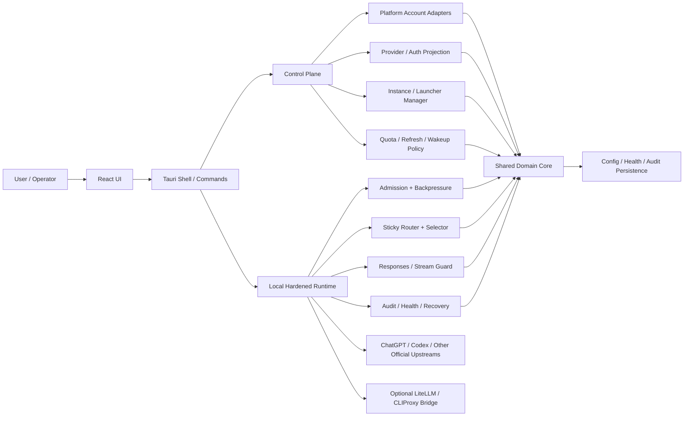

# Cockpit Tools Local Target Architecture

状态：active
更新时间：2026-06-06

## 1. 目的

本文件定义 Cockpit Tools Local 的项目级最佳工程终态。它回答四个问题：

1. 本项目最终应该收敛成什么产品形态。
2. 最适合长期维护的技术栈和架构边界是什么。
3. 官方文档、官方源码、社区优秀项目各自应该提供什么约束。
4. 哪些方向明确不应该成为本项目的终态。

本文件是项目级目标架构蓝图；它高于零散讨论结论，但不替代产品合同、实施计划和运行手册。

关联文档：

- 产品合同：`docs/HARDENED_API_PRODUCT_REQUIREMENTS.md`
- 总控入口：`docs/HARDENED_API_MASTER_PLAN.md`
- 总体路线：`docs/LOCAL_HARDENED_API_ROADMAP.md`
- 协议附录：`docs/LOCAL_HARDENED_API_CODEX_RESPONSES_PROTOCOL.md`
- 参考源码：`docs/reference-sources.md`
- 参考审查：`docs/reference-gateway-best-practices.md`
- 自用差异：`docs/SELF_USE_DELTA.md`
- 官方吸收：`docs/UPSTREAM_SYNC_POLICY.md`

## 2. 北极星

Cockpit Tools Local 的最佳终态不是“更大的通用公网网关”，而是：

**一个 Windows-first 的本地桌面控制面 + 一个只监听 `127.0.0.1` 的本地 Hardened API Runtime。**

它的核心职责是：

- 作为多平台 AI IDE 账号、provider、quota、实例和运行时策略的本机控制面。
- 对 Codex 提供官方语义优先的本地 runtime，包括 Responses、turn continuity、quota/cooldown、sticky routing 和显式 recovery。
- 对其他平台保持适配器式扩展，而不是把整个项目重心拖成多租户服务端网关。

## 3. 最佳产品形态

| 领域 | 最佳终态 | 不应演化成 |
| --- | --- | --- |
| 产品身份 | 自用桌面控制台 + 本地 runtime | 公网 SaaS、中转平台、多租户网关 |
| 网络边界 | 仅本机 loopback，默认 `127.0.0.1` | LAN/public listen |
| Codex 支持 | Responses-first、本地 continuity/runtime 合同 | 只做浅层 OpenAI-compatible 转发 |
| 账号池 | 小池、低并发、可解释、可恢复 | 500+ 账号高频扫射池 |
| 可观测性 | health registry + audit trail + acceptance summary | 只有零散日志、出事后手查 |
| 更新与发布 | self-use release、最小 capability、可回滚 | 静默扩权、模糊 updater 语义 |

## 4. 架构原则

1. **模块化单体优先**
   本项目最佳终态是 modular monolith，不是微服务。桌面产品、本地状态、强 OS 集成、低运维目标，都不支持把它拆成多个常驻服务。
2. **控制面与运行面分离**
   Cockpit UI/配置/账号管理是 control plane；本地 API runtime、selector、stream guard、backpressure 是 runtime plane。二者必须解耦，但仍属于同一产品。
3. **官方语义优先**
   Codex-facing 行为先对齐 OpenAI 官方文档与 `openai/codex` 源码，再参考社区网关结构。
4. **Windows-first，核心可移植**
   Windows 是一级体验目标；Rust domain/runtime 核心应尽量跨平台，Windows 专属逻辑收敛在 shell/integration 层。
5. **本地安全边界先于能力扩张**
   先确保 capability、updater、shell/process、日志、凭据和 loopback 边界，再增加体验能力。
6. **可解释性是一等需求**
   账号为什么被选中、为什么被跳过、为什么 cooldown、为什么 pool_unavailable，必须能在 UI 和 report 中解释。
7. **兼容桥接是可选层，不是真源**
   LiteLLM、CLIProxyAPI sidecar、其它兼容层只能是 optional compatibility bridge，不能取代 Cockpit 作为账号真源和策略真源。

## 5. 推荐技术栈

| 层 | 推荐终态 | 说明 |
| --- | --- | --- |
| Desktop shell | `Tauri 2` + Rust | 最适合本地权限边界、体积、OS 集成和能力最小化 |
| Frontend | `React 19` + `TypeScript` + `Vite` | 继续沿用现有栈，强化 view/view-model/contracts 分层 |
| Domain core | Rust crates | 账号、provider、quota、projection、health、policy 统一在 Rust 域层 |
| Local runtime | Rust 本地 HTTP/SSE runtime | Responses adapter、routing、backpressure、stream guard 放在 Rust 端 |
| Persistence | versioned JSON/TOML/JSONL 优先 | 配置、health、audit 先保持本地文件化；查询复杂度明显上升前不引入重数据库 |
| Optional data engine | SQLite only if justified | 仅当历史查询/聚合/趋势分析已经明显超出 JSONL 能力时引入 |
| Optional compatibility | LiteLLM / CLIProxyAPI bridge | 只做兼容或桥接，不保存 OAuth 真源、不接管控制面 |
| Verification | cargo tests + TS typecheck + smoke scripts + preflight | 保持本地 focused tests 与 app-safe acceptance 并行 |

## 6. 逻辑架构

## 7. 子系统边界

### 7.1 Shared Domain Core

这是本项目长期最应该稳定的中心层，负责：

- account identity / alias / binding
- provider selection / projection rules
- quota snapshot / cooldown / health state
- runtime policy / preset / safety defaults
- schema migration / compatibility

它不负责：

- 具体 UI 交互
- 窗口/托盘行为
- 具体 HTTP/SSE 传输细节

### 7.2 Platform Account Adapters

每个平台都应是“适配器”，而不是彼此耦合的散乱实现。每个 adapter 只负责：

- 本机凭据读取/写回
- quota/status 解析
- instance 注入/启动所需的最小差异

不应把平台专属逻辑泄漏成全局框架规则。

### 7.3 Control Plane

Control plane 负责：

- UI 状态、用户动作、策略应用
- account/pool/member 管理
- provider/runtime mode 切换
- release/update/operator-facing diagnostics

它必须是所有“谁是当前账号、谁在号池里、当前策略是什么”的唯一用户入口。

### 7.4 Local Hardened Runtime

这是 Codex 相关最关键的战略子系统，长期应稳定为：

- Responses-first
- hard-affinity aware
- pre-stream rescue only
- active stream lease protected
- pool_unavailable explicitly contracted

它不应退化成：

- 简单 1:1 HTTP proxy
- 大池随机路由器
- 只靠日志解释行为的黑盒

### 7.5 Observability and Recovery

最佳终态必须原生包含：

- health registry
- redacted audit trail
- manual recovery / pause / resume
- acceptance summary
- hotspot review references

这层不是“补充功能”，而是产品合同的一部分。

## 8. 官方与社区的职责边界

| 来源 | 应直接对齐什么 | 应吸收什么 | 不应照搬什么 |
| --- | --- | --- | --- |
| OpenAI 官方文档 | Responses、`previous_response_id`、error codes、rate limits、compaction | 公开协议语义与错误处理边界 | 非本地产品上下文中的默认运营假设 |
| `openai/codex` | turn state、continuation、stream terminal、phase/state 管理 | Codex-facing runtime 语义 | 与本项目无关的 CLI/TUI 细节 |
| Tauri 2 官方 | capability、security、updater、runtime 边界 | 最小权限和桌面宿主最佳实践 | 不经审查地扩大插件/权限窗口 |
| `CLIProxyAPI` | 无 | fill-first、session affinity、首字节后不重试 | 平台化多凭据激进重试默认值 |
| `sub2api` | 无 | `IsSchedulable()`、persistent cooldown、health panel 思路 | DB/Redis/scheduler 重量级基础设施 |
| `LiteLLM` | 无 | pre-call rate checks、cooldown matrix、proxy observability | 把整个代理平台架构搬进桌面产品 |
| `new-api` | 无 | retry/disable/backpressure 框架化思路 | request-level weighted/random routing 作为默认路径 |

## 9. 最佳数据与状态终态

推荐保持以下数据分层：

- 用户可理解配置：JSON/TOML
- 运行时健康状态：versioned JSON
- 审计事件：append-only JSONL
- 指标/基线报告：`reports/`

只有当同时出现以下信号时，才考虑引入 SQLite：

- 需要按时间窗口高频查询历史事件
- 需要跨多个实体做聚合分析
- JSONL 读取已明显拖累日常交互

在那之前，不推荐把本地桌面工具过早数据库化。

## 10. 安全与权限终态

最佳安全终态应满足：

- 本地 API 默认只监听 `127.0.0.1`
- Tauri capability 按功能最小化拆分
- updater 被视为高影响面能力，并有明确签名/回滚语义
- 日志、UI、report 不泄露完整 key/token/email/prompt/response
- live upstream probe、drain、dev app/server、release 替换都维持显式确认边界

不应为了“方便调试”长期保留：

- LAN/public binding
- 宽泛 shell/process/fs 权限
- 原始 upstream body 日志
- 高频 quota recovery probing

## 11. 最佳工程终态清单

当以下条件都成立时，可以认为本项目已接近最佳工程终态：

1. 项目整体是 modular monolith，而不是临时拼接的多进程系统。
2. Control plane 与 runtime plane 边界清晰。
3. Codex-facing 路径以 Responses-first 契约运行。
4. pool scheduling 默认是 `sticky_process + fill_first + capped fallback`。
5. `pool_unavailable`、hard-affinity、active stream lease 都有稳定协议和验收。
6. 平台 adapter 共享 core domain，但不过度抽象成脆弱“大一统插件框架”。
7. 所有高影响面能力都有 preflight、report 和 rollback。
8. 官方更新可以通过 review worktree 稳定吸收，而不会冲垮自用差异。

## 12. 明确反目标

以下方向不应成为本项目终态：

- 公网或企业多租户 API gateway
- 500+ 账号高频自动轮询平台
- 为绕过平台限制而设计的 anti-detection 系统
- 以 sidecar 或外部代理替代 Cockpit 控制面的架构
- 未经证据支持就引入 Redis、消息队列、微服务或复杂插件系统

## 13. 与现有路线图的关系

- 本文件定义“最终收敛成什么”。
- `docs/HARDENED_API_PRODUCT_REQUIREMENTS.md` 定义“为什么做、做成什么算成功”。
- `docs/LOCAL_HARDENED_API_ROADMAP.md` 定义“按什么阶段推进”。
- `docs/LOCAL_HARDENED_API_IMPLEMENTATION_PLAN.md` 定义“当前切片具体怎么做”。

如果后续局部计划与本文件冲突，应优先回看本文件是否已经明确：

- 产品仍是本地控制面，而不是公网网关；
- Codex-facing 仍应官方语义优先；
- 社区项目仍只提供结构参考，不接管本项目的主架构。
